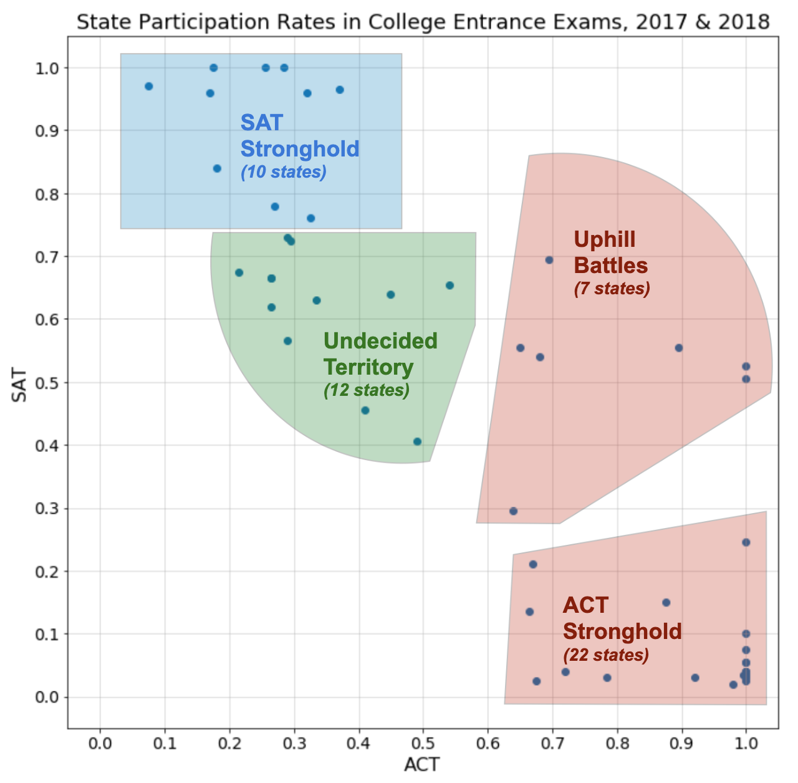

# Problem Statement

The SAT lost its market-leader position in 2012 after years of decline, but – after significant overhauls to the exam and exclusivity contracts with two US states – reclaimed its pole position in 2018. But the SAT is far from dominating the landscape.

The senior leadership team at The College Board has engaged Dunder-Mifflin Consulting, LLC, to offer data-driven recommendations on how to increase participation rates in states where the SAT is not performing well relative to the other major player in the space, the ACT.

# Executive Summary

### Progress Update

* Two weeks into our project, we've completed initial analysis on the datasets provided by The College Board's reporting team.
* We've constructed a "battle map" to visualize the landscape of participation rates, and we've segmented the US states into four buckets to frame our conversations:
    - SAT Strongholds
    - Undecided Territory
    - Uphill Battles
    - ACT Strongholds
* We've identified several initial areas to examine more closely:
    - **Push into ACT Strongholds** where a requirement exists and the SAT is already “on the table” [OH, OK, SC, TN]
    - **Dig deeper on low WV participation rates**, given the SAT requirement
    - **Opportunistically convert “Undecided Territories” into “Strongholds”** based on market characteristics (e.g. size, potential for School Board relationships at state or district level )

### Next Steps
* Discuss "areas to examine" ideas with market owners of OH, OK, SC, TN, WV
* Collect and analyze data for two key questions:
    - Planned college destinations by state
        - Where do students apply?
        - What are those schools’ testing requirements?
        - Will help us determine targets
        - Schools (to influence preferences for entrance exams)
        - State expansions (where the destination schools already favor the SAT)
    - Market analyses of “Undecided Territories”

# Data Dictionary

|
Dataset|
Feature|
Type|
Description|
Valid Range|
| --- | --- | --- | --- | --- |
|
ACT & SAT|
**state**|
`index`|
State to which data in the row corresponds|N/A|
|
ACT|
**act_YYYY_participation**|
`float64`|
Percentage of state's graduating seniors that took the ACT in the year indicated|0.00 to 1.00|
|
ACT|
**act_YYYY_english**|
`float64`|
Average score for state on the English section of the ACT for the year indicated|1.0 to 36.0|
|
ACT|
**act_YYYY_math**|
`float64`|
Average score for state on the Math section of the ACT for the year indicated|1.0 to 36.0|
|
ACT|
**act_YYYY_reading**|
`float64`|
Average score for state on the Reading section of the ACT for the year indicated|1.0 to 36.0|
|
ACT|
**act_YYYY_science**|
`float64`|
Average score for state on the Science section of the ACT for the year indicated|1.0 to 36.0|
|
ACT|
**act_YYYY_composite**|
`float64`|
Average Composite ACT score for state for the year indicated|1.0 to 36.0|
|
SAT|
**sat_YYYY_participation**|
`float64`|
Percentage of state's graduating seniors that took the SAT in the year indicated|0.00 to 1.00|
|
SAT|
**sat_YYYY_ebrw**|
`int64`|
Average score for state on the Evidence-Based Reading and Writing section of the SAT for the year indicated|200 to 800|
|
SAT|
**sat_YYYY_math**|
`int64`|
Average score for state on the Math section of the SAT for the year indicated|200 to 800|
|
SAT|
**sat_YYYY_total**|
`int64`|
Average Total SAT score for state for the year indicated|400 to 1,600|
|
SAT|
**avg_act_participation**|
`float64`|
Average percentage of state's graduating seniors that took the ACT in 2017 and 2018|0.00 to 1.00|
|
SAT|
**avg_sat_participation**|
`float64`|
Average percentage of state's graduating seniors that took the SAT in 2017 and 2018|0.00 to 1.00|
|
SAT|
**participation_bucket**|
`object (string)`|
_Battle Map_ bucket into which the state was categorized based on average SAT & ACT participation rates. The _Battle Map_ is shown in the Executive Summary|`SAT Stronghold` `ACT Strongold` `Undecided Territory` `Uphill Battles`|

# Conclusion

### Recommendations

* **Push into ACT Strongholds** where a requirement exists and the SAT is already “on the table” [OH, OK, SC, TN]
* **Dig deeper on low WV participation rates**, given the SAT requirement
* **Opportunistically convert “Undecided Territories” into “Strongholds”** based on market characteristics (e.g. size, potential for School Board relationships at state or district level )

### Next Steps
* Discuss "areas to examine" ideas with market owners of OH, OK, SC, TN, WV
* Collect and analyze data for two key questions:
    - Planned college destinations by state
        - Where do students apply?
        - What are those schools’ testing requirements?
        - Will help us determine targets
        - Schools (to influence preferences for entrance exams)
        - State expansions (where the destination schools already favor the SAT)
    - Market analyses of “Undecided Territories”
